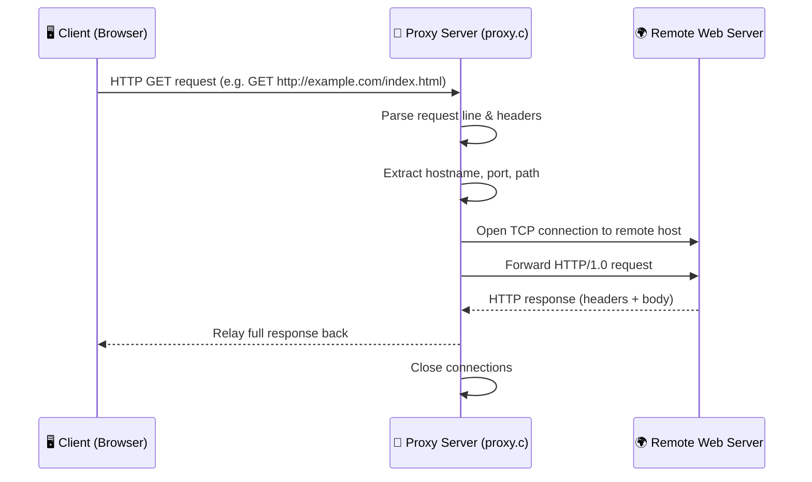
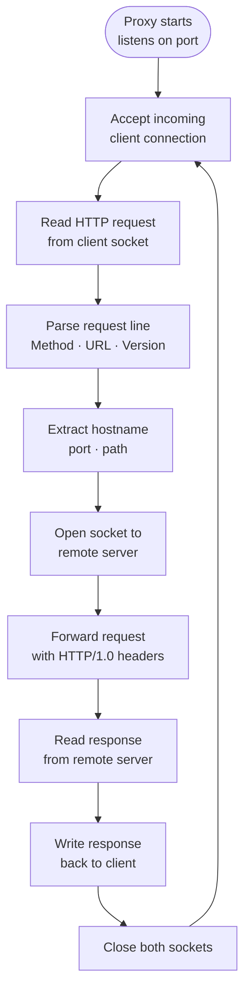

# 🌐 Creating a Web Proxy

> A multithreaded HTTP/1.0 web proxy written in C — forwarding client requests, handling concurrent connections, and sitting between a browser and the web.


---

## What is this?

A web proxy is a server that sits between a client (like a browser) and the internet — receiving HTTP requests, forwarding them to the destination server, and relaying the response back. This project implements one from scratch in C, built on top of the `csapp` helper library from the *Computer Systems: A Programmer's Perspective* textbook. It handles real HTTP/1.0 traffic, parses request headers, opens socket connections to remote servers, and is designed to support concurrent clients.

---

## ✨ Key Features

- **HTTP/1.0 Proxying** — Parses and forwards GET requests to remote web servers
- **Socket Programming** — Opens TCP connections on both the client-facing and server-facing sides
- **Concurrent Connections** — Handles multiple clients simultaneously
- **Port Utilities** — Includes scripts to find a free port or generate a user-specific port
- **Tiny Web Server** — Bundled lightweight HTTP server from CSAPP for local testing
- **Clean Build System** — Single `make` command to compile the entire project

---

## 🛠 Tech Stack

| Component | Technology |
|---|---|
| Language | C (C99) |
| Networking | POSIX Sockets (`sys/socket.h`) |
| Helper Library | `csapp.c` / `csapp.h` (CSAPP textbook) |
| Build System | GNU Make |
| Port Utilities | Perl (`port-for-user.pl`), Bash (`free-port.sh`) |
| Test Server | Tiny HTTP server (CSAPP) |

---

## 🏗 How It Works



### Request Lifecycle



---

## 🚀 Getting Started

### Prerequisites

- Linux or Unix-based system (Ubuntu, macOS, WSL)
- GCC compiler
- GNU Make

### Installation

1. **Clone the repository**

```bash
git clone https://github.com/IvanD1061/Creating-Web-Proxy.git
cd Creating-Web-Proxy
```

2. **Build the proxy**

```bash
make
```

For a clean rebuild:

```bash
make clean && make
```

---

## 📖 Usage

### Find an available port

Using the Bash script:

```bash
./free-port.sh
```

Or generate a port tied to your user ID:

```bash
./port-for-user.pl <userID>
```

### Start the proxy

```bash
./proxy <port>
```

Example:

```bash
./proxy 15213
```

### Test with the Tiny web server

Start the Tiny server on a separate port:

```bash
cd tiny_folder
./tiny 8080
```

Then point your proxy at it, or use `curl` to send a request through the proxy:

```bash
curl --proxy http://localhost:15213 http://localhost:8080/home.html
```

### Test with a real browser

Configure your browser's HTTP proxy settings to:

```
Host: localhost
Port: <your chosen port>
```

Then browse normally — all traffic will route through the proxy.

---

## 📁 Project Structure

```
Creating-Web-Proxy/
├── proxy.c             # Main proxy implementation
├── csapp.c             # CSAPP helper library (sockets, I/O wrappers)
├── csapp.h             # CSAPP header file
├── Makefile            # Build configuration
├── free-port.sh        # Finds an unused TCP port
├── port-for-user.pl    # Generates a port from a user ID
├── home.html           # Sample HTML page for local testing
├── tiny_folder/        # Tiny web server (CSAPP textbook)
└── pa4_documentation.pdf  # Assignment specification
```

---

## 🤝 Contributing

1. Fork the repository
2. Create a feature branch: `git checkout -b feature/your-feature`
3. Commit your changes: `git commit -m "Add your feature"`
4. Push and open a Pull Request
